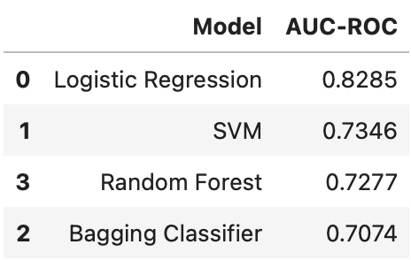

# Data Science Salary Predictions

COMS W4995 Final Project, Group 26

Jasmine Jiawei Chen, Vedant Goyal, Usman Ali Moazzam, Kanisha Arpit Shah, Lin Zhu,

## Background and Problem Statement

In recent years, roles related to data science, including data scientists, data analysts, machine learning engineers, data engineers, and more, have seen remarkable growth and garnered significant attention for their pivotal roles in reshaping industries. Situated at the intersection of computer science, mathematics, and domain expertise, these roles have collectively become instrumental in extracting insights from vast datasets and driving data-driven decision-making. The descriptor "the sexiest jobs of the 21st century" gained prominence, notably in the article "Data Scientist: The Sexiest Job of the 21st Century," which was published in the Harvard Business Review in 2012
(Davenport & Patil, 2012). This phrase captures the allure and high demand associated with roles that encompass data analysis, machine learning, and data engineering. As data generation continues to surge due to technological advancements, these professionals have become indispensable, sought-after experts.

Understanding salary trends and factors influencing compensation is pivotal for both aspiring and current professionals in these fields. Our group project addresses this need by utilizing a comprehensive dataset that encompasses demographic information, technical skills, learning resources, and more. We aim to develop a series of machine learning models capable of predicting salaries for professionals in these data-centric roles. This initiative empowers individuals to make informed career decisions and assists organizations in attracting and retaining top talent in the competitive landscape of data-related professions, contributing to the continued growth and success of these roles in the 21st century.

## Dataset

### General Information

The data came from a survey run by Kaggle in 2020. The survey was open for approximately one month and collected over 20,000 responses. In addition to collecting more basic information such as compensation, job title and size of the company, the survey includes data on the type of technology used by the professionals and their companies. In total, the survey included 39 features, most of which were categorical. This includes the target variable, salary, which was submitted in bins containing ranges of salary in USD.

### Feature Selection

We selected a total of 21 questions out of 39. These questions were selected based on their perceived impact on an individual’s salary, such as questions about basic demographics, company information, high-level professional/academic background, knowledge of ML related techniques/skills, and other aspects of their preferred tech stack. Questions that were hyperspecific and without much perceived impact on salary were removed from the models.

### Data Cleaning

As mentioned above, much of the data is categorical, which was handled using ordinal encoding or one-hot encoding. In the case of our target variable, salary, we also re-binned the categories, reducing the number of bins. Reducing the number of bins for a categorical target variable can enhance accuracy by mitigating noise and overfitting. With a more concise representation, the model can focus on essential patterns, leading to increased robustness and better generalization to new data. The simplification of decision boundaries, especially in tree-based models, contributes to interpretability and reduces susceptibility to capturing noise. Additionally, the computational efficiency gained from working with a reduced number of bins can expedite training times, especially for resource-intensive algorithms.

In addition, some of the questions were in multi-selection format; in order to reduce the resulting high-dimensionality, these questions were converted into single column questions, where the questions' meaning was altered to fit a binary-structured answer. For example, for a question asking about a number of niche neural network-related tech stacks, we modified the question to be based on whether they selected an option or selected none of the above, changing the meaning of the question to ask whether they used any neural network-related tech stacks rather than determining which ones they specifically they used. We would first convert each column into binary indicators based on whether or not there is content in that row. Next, we would sum all the columns for that question. Then, any non-zero value is converted into 1. While it is possible that being able to use more than one tool proficiently can increase one’s hireability, the salary increase may follow the law of diminishing returns.

## Model Selection

### Logistic Regression

Logistic regression effectively serves as a straightforward baseline model due to its simplicity and interpretability. When transitioning to more complex models such as Support Vector Machines (SVMs), boosting, bagging, and deep learning, logistic regression's simplicity becomes advantageous for comparison. SVMs aim to find optimal hyperplanes, boosting combines weak learners to form a strong model, bagging builds diverse models for robustness, and deep learning leverages neural networks for intricate patterns. By establishing logistic regression as a baseline, one can assess the incremental improvement and complexity trade-offs introduced by these advanced models in a systematic manner, providing valuable insights into the performance gains achieved through model sophistication. Our LR model was fine-tuned through a meticulous exploration of three critical hyperparameters - 'solver,' 'penalty,' and 'C’ - along with 'max_iter' to control the maximum number of iterations for convergence. These hyperparameters were carefully selected to enhance the model's flexibility and prevent overfitting, balancing the trade-off between complexity and generalization. The exploration of different solvers allows us to adapt to diverse optimization landscapes, while the 'C' parameter fine-tunes the regularization strength, crucial for preventing the model from memorizing noise in the training data. By systematically tuning these hyperparameters, our logistic regression model is poised to offer a robust baseline, setting the stage for a comparative analysis with more intricate models in our applied machine learning project.

### Support Vector Machines

Support Vector Machines (SVMs) stand out as powerful models for classification tasks, leveraging the concept of hyperplanes to separate different classes in a feature space. In our project predicting salaries in data-centric professions, we employed a Support Vector Classifier (SVC) with the Radial Basis Function (RBF) kernel, a popular choice for capturing non-linear relationships in the data. The hyperparameters tuned for the SVC were 'C' and 'gamma.' 'C' controls the regularization strength, determining the trade-off between achieving a smooth decision boundary and accurately classifying training points. A higher 'C' value allows for a more complex decision boundary, potentially leading to overfitting, while a lower 'C' value enforces a simpler boundary, risking underfitting. 'Gamma' influences the shape of the decision boundary, with higher values leading to a more intricate boundary that may overfit the training data. SVMs excel in scenarios with clear class separation and are particularly effective in high-dimensional spaces. However, they may be sensitive to the choice of hyperparameters and could be computationally intensive for large datasets. By fine-tuning 'C' and 'gamma,' our goal is to strike a balance between model complexity and generalization, harnessing the inherent strengths of SVMs while mitigating potential drawbacks. The application of SVMs in our machine learning project serves to evaluate their performance against other models, contributing to a comprehensive analysis of predictive capabilities in the context of salary prediction for data science roles.

### Boosting

Boosting, a powerful ensemble technique, enhances predictive performance by combining multiple weak learners sequentially, where each learner corrects the errors of its predecessor. In our project predicting salaries for data-centric roles, we embraced various boosting algorithms, including Gradient Boosting, XGBoost, LightGBM, and CatBoost. These algorithms have demonstrated efficacy in handling high-dimensional and complex data, complementing the ensemble approach adopted in our project. Cat Boosting, a widely used boosting algorithm, was fine-tuned by adjusting hyperparameters such as 'learning_rate,' 'max_depth,' 'n_estimators,'. The learning rate controls the contribution of each tree to the ensemble, while 'max_depth' limits the depth of the individual trees. The number of estimators ('n_estimators') influences the overall strength of the ensemble.. These hyperparameters collectively contribute to the algorithm's ability to iteratively improve predictive accuracy. By strategically tuning these hyperparameters, we aimed to harness the strengths of boosting techniques, providing a robust ensemble framework. Boosting methods are particularly valuable in scenarios with high bias and low variance, excelling in situations where weak learners can be combined to create a strong predictive model. Despite their strengths, it's crucial to note that boosting algorithms may be sensitive to outliers and noisy data, and careful consideration of hyperparameter settings is essential for optimal performance. The selection of the best-performing boosting algorithm, CatBoost, underscores its suitability for our specific predictive modeling task.

### Bagging

Bagging, short for Bootstrap Aggregating, represents a powerful ensemble technique that enhances predictive performance by training multiple base models independently on various subsets of the dataset. In our project predicting salaries for data-centric roles, we employed both a Bagging Classifier and a Random Forest model, recognizing the utility of bagging techniques in handling high-dimensional and complex data. The Bagging Classifier was fine-tuned primarily on the 'n_estimators' hyperparameter, specifying the number of base learners to be aggregated. This parameter governs the diversity of the ensemble, influencing the model's ability to generalize well on unseen data. Bagging techniques excel in reducing overfitting and increasing model stability, making them particularly suitable for high-variance, low-bias scenarios. However, they may not perform as effectively in situations with highly correlated features, where the ensemble's diversity is limited. Random Forest, an extension of bagging, introduces additional hyperparameters such as 'criterion' and 'max_depth' to control tree-specific attributes. 'Criterion' determines the quality of the split, and 'max_depth' sets the maximum depth of the individual decision trees. These hyperparameters offer flexibility in managing the trade-off between model complexity and interpretability. By strategically tuning these parameters, we aim to harness the strengths of bagging techniques, mitigating their weaknesses, and providing a robust ensemble framework for comparison between the various types of models used in our project.

### Deep Neural Networks

Given the number of columns that are involved and the perceived complexity of the salary prediction problem, we hypothesized that Deep Neural Network (DNN) would be an excellent choice of model.
For the DNN, the first layer of the model would be a dense layer that has 80 nodes, corresponding to the 80 input features. The activation function of all layers except for the final output layer would be RELU as it is a function that has been proven to work well empirically. Further, since the majority of our feature columns are categorical before encoding, we do not expect to see extreme values and therefore don't need to use tanh as activation function. The final output layer of the model would have 4 nodes corresponding to the 4 salary bins we have created. 
As our attempt to find the best performing DNN, we experimented with both architectural changes such as width and depth, as well as various hyper parameters such as batch size and epochs. For architectural changes, we built models with either a single hidden layer or two hidden layers. For each layer, we tested widths and double the number of nodes each time from a single node to 1024 nodes.

The best performing model in the single layer model was the model with 2 nodes in the hidden layer. Similarly, in the two hidden layer DNNs, models with more narrow hidden layers (i.e. fewer number of nodes per hidden layer) performed better than models with wider hidden layers. Overall, DNNs with two hidden layers performed worse than those with a single hidden layer. It was very surprising to us that simpler models performed better than more complex ones in this particular instance, especially since we perceived the salary prediction problem as a complex one. One possible reason behind the poor performance of complex DNNs is that after dropping target column NAs, we were only left with around 10,000 observations. Once we split for validation and test dataset, the available data for training is further reduced. However, we had 80 features even after limiting columns to the selected questions. Therefore, the complex DNNs likely did not have enough data to properly learn from.

## Results

Binned targets vs Un-binned targets

### Metric Selection

When grading and comparing a variety of models applied towards a multi-classification problem, the Receiver Operating Characteristic (ROC) curve and the corresponding Area Under the Curve (AUC) emerges as a robust metric for comprehensive model evaluation. ROC/AUC's threshold independence and ability to handle class imbalances make it well-suited for multi-class scenarios. The metric facilitates straightforward model comparison, providing a single scalar value that summarizes overall performance. Its visual representation of the trade-off between true positive and false positive rates allows for a nuanced understanding of model behavior across different operating points. Furthermore, ROC/AUC is insensitive to class labeling and prediction score scaling, ensuring reliable assessments even when working with diverse classifiers. In conclusion, the use of ROC/AUC in our analysis proved invaluable, offering a holistic perspective on the discriminative power and diagnostic capability of Logistic Regression, SVMs, bagging, boosting, and deep learning models in our multi-class classification framework.

### Model Comparison

This in-depth report conducts a thorough analysis of diverse predictive modeling techniques applied to the intricate task of predicting salaries for data science roles. Our exploration encompasses Logistic Regression, Support Vector Machine (SVM), Bagging techniques (including Bagging Classifier and Random Forest), Boosting (specifically CatBoostClassifier), and Deep Neural Networks (DNN). These models are rigorously evaluated on a dataset featuring varying observations and a multitude of features.

### Logistic Regression

Logistic Regression, meticulously optimized with specific hyperparameters, emerges as a foundational model offering satisfactory insights. Despite its inherent linearity, it serves as a vital tool for laying the groundwork in understanding the dataset's nuances. The recognition of its limitations in capturing intricate non-linear relationships underscores the necessity of exploring models with heightened complexity.

- ROC-AUC (Without Binning): 0.8285

- ROC-AUC (After Binning): 0.9146

### Support Vector Machine (SVM)

The application of Support Vector Machine (SVM) with carefully tuned hyperparameters showcases a model with a commendable level of adaptability. The discernible ability to navigate complex decision boundaries, particularly evidenced by the improvement achieved through binning, positions SVM as a versatile tool capable of addressing diverse scenarios.

- ROC-AUC (Without Binning): 0.7346;

- ROC-AUC (After Binning): 0.7638

### Bagging Techniques

Bagging techniques, including Bagging Classifier and Random Forest, offer intriguing insights. Their observed suboptimal performance, relative to Logistic Regression, suggests an inherent favoring of simpler models in the face of linear relationships within the dataset. Furthermore, the sensitivity of random forest methods to data noise adds a layer of complexity to our understanding of the observed performance gap.

- Random Forest ROC-AUC (Without Binning): 0.7277

- Bagging Classifier ROC-AUC (Without Binning): 0.7074

- Random Forest ROC-AUC (After Binning): 0.7904

- Bagging Classifier ROC-AUC (After Binning): 0.8008

### Boosting (CatBoostClassifier)

The exploration of Boosting techniques, notably CatBoostClassifier, stands out for its seamless handling of categorical features. Its performance, achieved with minimal hyperparameter tuning, positions it as an attractive option for scenarios where efficiency and adaptability are crucial. The selection of the optimal model becomes a nuanced decision, dependent on dataset characteristics and the intricate balance between model complexity, interpretability, and performance.

ROC-AUC (After Binning): 0.8447

### Deep Neural Network (DNN)

Within the realm of Deep Neural Networks (DNNs), our exhaustive experimentation with architecture and hyperparameters yields unexpected findings. The surprising outperformance of simpler DNN models over their more complex counterparts hints at the dataset's limitations. This underscores the critical importance of model simplicity, particularly in scenarios where data availability for training is constrained.

- ROC-AUC (Without Binning): 0.5864

### Summary

In conclusion, our analysis provides a comprehensive and nuanced perspective on various predictive modeling techniques. Logistic Regression, SVM, Bagging, Boosting, and DNNs present diverse avenues for exploration, each with its distinctive strengths and considerations. The selection of the optimal model necessitates a nuanced understanding of dataset characteristics and a delicate consideration of the trade-off between model complexity and adaptability.

The ROC-AUC values further emphasize the performance of each model, both with and without binning the target variable. Logistic Regression, particularly after binning, demonstrates a notable lead in discriminatory ability. However, the intricate balance between interpretability and performance is evident, making each model selection a strategic decision based on specific use cases and dataset characteristics. This exhaustive exploration not only lays the foundation for further refinement but also provides valuable insights into effective salary prediction for data science roles.

## Conclusion

In the realm of data-centric professions, predicting salary expectations for data scientists is a critical aspect that directly influences career decisions and industry dynamics. A machine learning model designed to accurately forecast the salary of a data scientist based on their survey responses can be immensely valuable for both individuals and organizations. As aspiring and current professionals seek to navigate the competitive landscape of data-related roles, having insights into the factors influencing compensation can guide informed career choices. Moreover, organizations can leverage such a model to strategically attract and retain top talent in a field where expertise is in high demand. By incorporating demographic information, technical skills, and learning resources into our predictive models, our applied machine learning project not only provides a pragmatic solution to address the needs of data professionals but also contributes to the ongoing success and growth of these roles in the 21st century. As we delve into the intricate relationship between survey responses and salary outcomes, our work aims to empower individuals and organizations alike, fostering a deeper understanding of the dynamics shaping the remuneration landscape for data scientists and related roles.
